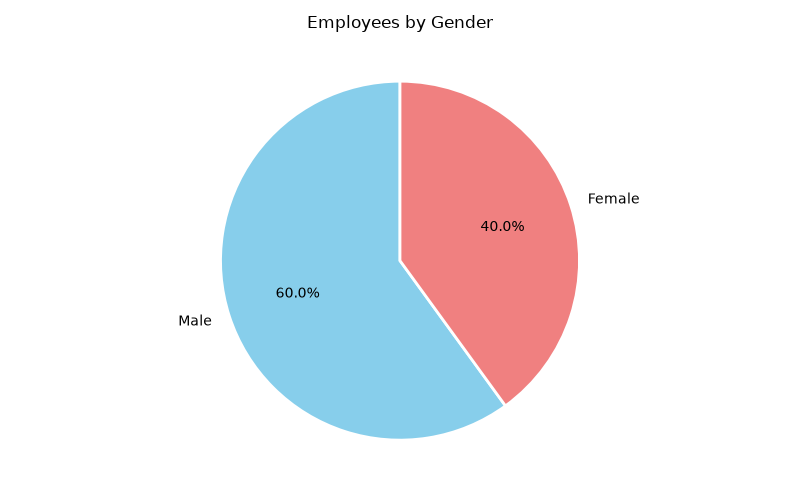
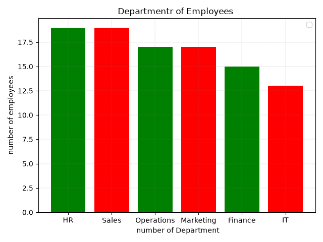
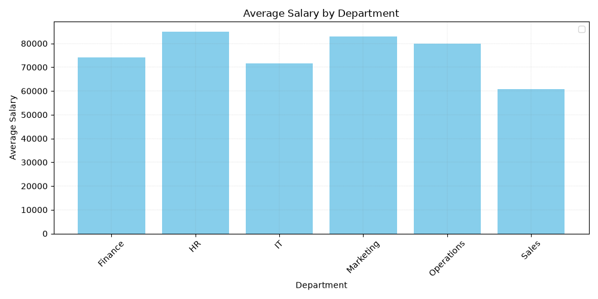
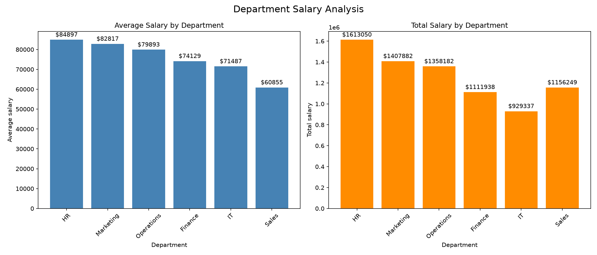
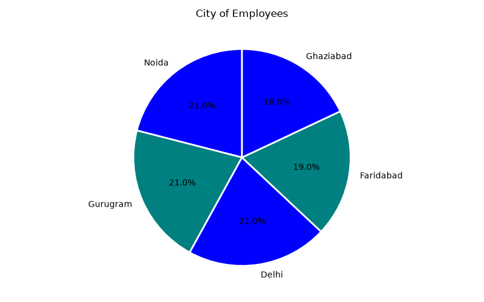

# Employee Data Analysis

## 📌 Overview
A data cleaning and exploratory data analysis (EDA) project on a local company's employee dataset, built with **Python, Pandas, NumPy, and Matplotlib**. The project covers missing-value handling, outlier removal, and visual analysis of employee demographics, department distribution, salary trends, and city-wise spread.

## 📂 Dataset
The raw dataset (`local_company_employees.csv`) contains one record per employee:

| Column | Description |
|---|---|
| EmployeeID | Unique identifier for each employee |
| Name | Employee name |
| Age | Employee age |
| Gender | Male / Female |
| Department | HR, IT, Sales, Marketing, Finance, Operations |
| Designation | Job title / role |
| Salary | Annual salary |
| Experience | Years of experience |
| City | Employee's city (Delhi-NCR region) |
| JoiningDate | Date the employee joined |
| PerformanceRating | Performance score |

After cleaning, the dataset contains **100 employee records** across 6 departments.

## 🧹 Data Cleaning Steps
`Employ_data_set.py` runs the following pipeline:

1. Loads the raw CSV and checks missing values per column
2. Fills missing `Salary` values with the column mean
3. Fills missing `PerformanceRating` values with the column median
4. Replaces infinite values with `NaN`, then fills any remaining numeric gaps with column means
5. Removes duplicate records
6. Replaces invalid negative salaries with `NaN`
7. Removes salary outliers falling outside **mean ± 3×standard deviation**
8. Drops any remaining rows with missing values in core columns
9. Exports the cleaned dataset to `local_company_employees_cleaned.csv`

## 📊 Visualizations

**Employees by Gender**

60% Male, 40% Female.

**Employees by Department**

HR and Sales have the largest headcount (19 each); IT has the fewest (13).

**Average Salary by Department**

HR pays the highest average salary (~$84,897); Sales the lowest (~$60,855).

**Department Salary Analysis — Average vs. Total**

Side-by-side view of average and total salary spend per department — HR leads on total spend ($1.61M) as well as average pay.

**Employees by City**

Fairly even spread across Delhi-NCR: Noida, Gurugram, and Delhi (21% each), Faridabad (19%), Ghaziabad (18%).

## 🔍 Key Insights
- Workforce skews male, with a 60/40 gender split
- **HR** has both the largest headcount and the highest average salary — also the top department by total salary spend
- **IT** has the smallest team and pays below the department median
- **Sales** ties for the largest headcount but has the lowest average salary
- Employees are spread fairly evenly across five Delhi-NCR cities, with a slight lean toward Noida, Gurugram, and Delhi

## 🛠️ Tech Stack
- Python 3
- Pandas — data cleaning & aggregation
- NumPy — numerical operations
- Matplotlib — visualizations

## 📁 Project Structure
```
├── Employ_data_set.py                       # Main data cleaning + analysis script
├── local_company_employees.csv              # Raw dataset (input)
├── local_company_employees_cleaned.csv      # Cleaned dataset (output)
├── employee_gender_count.png                # Gender distribution chart
├── employee_Department_count.png            # Department headcount chart
├── department_average_salary.png            # Average salary by department chart
├── department_salary_analysis.png           # Average + total salary comparison chart
├── employee_city_count.png                  # City distribution chart
└── README.md
```

## ▶️ How to Run
```bash
pip install pandas numpy matplotlib
python Employ_data_set.py
```
Update the hardcoded file paths in the script (currently `D:/numpy/...`) to match your local directory before running.

## 🚀 Future Improvements
- Explore the relationship between `Experience`, `PerformanceRating`, and `Salary`
- Add a correlation heatmap across the numeric features
- Break salary down by `Designation` in addition to `Department`
- Turn the static charts into an interactive dashboard (e.g., Streamlit or Plotly)

## ✍️ Author
**Kamal Prajapati**
B.Tech CSE student | Aspiring Data Scientist / AI Engineer
